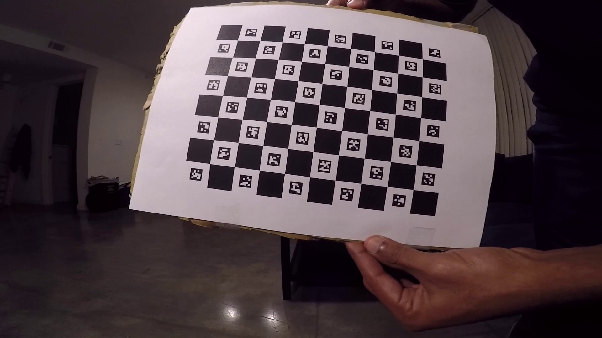

# Ping pong ball tracker (offline)

**Important note**: To have all elements displayed properly (for example images), please read this `README.md` file with a markdown renderer or as an easier alternative, on Github where this is hosted (https://github.com/aravindbattaje/ece6258project/blob/master/README.md).

This is part of the project for ECE-6258 (Digital image processing) at Georgia Tech. This is a segue project to an automatic ping pong ball refereeing system. This project only tries to implement reliable tracking of a ping pong ball in 3D space, using two cameras discreetly situated near the ends of the net of a ping pong table. [GoPro Hero3+ Silver](https://gopro.com/update/hero3_plus) and [GoPro Hero5 Black](https://gopro.com/update/hero5) cameras were used during development of this project, but the implementation should be reasonably extendable to any camera with a decent frame rate and wide enough view, for example [iPhone](https://www.apple.com/iphone-8/) with [Ollo clip-on lens](https://www.olloclip.com/shop/shop/connect-super-wide-lens/).

The ping pong tracker is developed in Python. Once the videos from the two calibrated cameras are captured, it can be simply supplied to the software. The undisorted image from each camera is displayed

along with a nice looking user-interactive 3D visualization of the ball being tracked in the videos.

## Prerequisites

- Python 2.7.x
- OpenCV 3.3.0+
- Numpy 1.13+
- Matplotlib 1.5+ (Not required if running only `ping_pong_tracker.py`)
- Mayavi 4.5.0+
  - Additional dependencies
    - Python bindings for VTK
    - PyQt4
    - Only Windows: Visual C++ for Python ([link](https://www.microsoft.com/en-us/download/details.aspx?id=44266))

All of the above libraries can be installed through package managers like `conda` (recommended) or `pip`. However, for Windows, if taking the `pip` route, it is recommended to get binary (wheels) from [Python Extension Packages for Windows](https://www.lfd.uci.edu/~gohlke/pythonlibs/).

Also in Windows, ensure `opencv_ffmpeg*.dll` file is present in the current directory or in `PATH`. This is required for using video files in the scripts.

**Important note**: `ping_pong_tracker.py` is optimized to run on Windows only. (It has been also tested on Linux.) However, there might be problems on Mac OS X due to the multiprocessing/multithreading constraints laid in its OS.

## Main scripts to use
- `calib_save_images.py`
- `calib_find_intrinsics_images.py`
- `calib_find_extrinsics_images.py`
- `ping_pong_tracker.py`

## File description and usage

### General usage

Get the usage instructions for a particular Python script `<python_file>.py` by typing the following in command line:

`python <python_file>.py -h`.

Also, generally use `q` key on the GUI to stop execution.

### Prepare for camera calibration

The camera intrinsic properties are found using a special calibration board. The calibration board can be generated by running

`python calib_generate_charuco.py`

This generates a calibration board in the root folder called `calib_charuco_board.png` like below image.

The parameters of the calibration board can be changed by editing the script.

### Find intrinsic parameters of camera

After the above generated calibration board is printed to 100% scale, and carefully displayed in various views in front of the camera, and recording the corresponding video, the following scripts can be used to find the intrinsic parameters a camera.

#### From images

First, manually select (at least 25) candidate images from the calibration video by running

`python calib_save_images.py --video <path_to_video_file>`

This opens a GUI showing the first frame of the video file. Click on playback slider to start playing video and click on it again to pause. Use the following keyboard shortcuts:

- `s` - Save current image
- `b` - Seek back 1 second
- `n` - Go ahead 1 second

The images will be stored in the folder `calib_images`. Example saved image:

These cherry-picked images will be used as input to the script that finds calibration parameters

`python calib_find_intrinsics_images.py --video <path_to_video_file> --model <P/F>`

The `--model/-m` argument specifies the camera projection model to use. The input can be either `P` for pinhole camera or `F` for fisheye model.

This script produces a file (`new_calib_<camera_model>.npz`) with the found calibration parameters. It also outputs the RMS error on terminal. Generally a _good_ calibration will have an RMS error less than 10. Also, the markers in the calibration board for each image are found and saved back in to the `calib_images` folder for inspection. Example:

`calib_find_intrinsics_images.py` expects the folder `calib_images` to be present in the root directory. It also accepts the normal `--video` argument that other scripts expect, as `<video_file_name>` is used as prefix for finding calibration images. If calibration video not available, fool this script with a dummy video (file name).

If satisified with the calibration, copy over the newly generated calibration configuration `new_calib_<camera_model>.npz` to `config` folder as `intrinsic_calib_<camera_model>_camera_<1/2>.npz`.

#### Directly from video

**Note: Deprecated.** Don't use this now. The script is retained to easily update in the future (for example, online implementation).

`python calib_find_intrinsics_video.py --video <path_to_video_file>`

The intrinsic calibration will be written to the file `new_calib.npz` in the root directory.

## Test scripts

There are several _test_ scripts in the repository that were constructed during development, and they usually encapsulate individual features. Some of the _test_ scripts maybe run to test out these individual features if desired. However, these scripts serve more as a template if further development in an individual feature is desired. The usage instructions for these scripts can be obtained by running

`python test_*.py -h`

**Note**: One particular test script -- `test_undistort.py` -- is extremely helpful in finding if we have a _good_ intrinsic calibration and also to get images for the next step (i.e., extrinsic calibration.) The usage for this is:

`python test_undistort.py --video <path_to_video_file> --model <P/F>`

This script reads the intrinsic calibration `new_calib_<camera_model>.npz` and displays undistorted version of the video file. If there was a _good_ calibration, straight lines in the world, for example edges of walls or ping pong table, that were distorted due to the imager optics must appear straight again in the undistorted video. The keyboard shortcut `s` saves the current video frame being viewed to two image files: Original video frame (distorted image) to `image_for_markers_orig.png` and Undistorted image to `image_for_markers_undistorted.png`.

## Find extrinsic parameters of camera

After performing intrinsic calibration for each of the camera successfully, the pose of each camera with respect to the ping pong table needs to be found. Currently, only a manually intervened process for finding camera position is supported, although extending the software to do it automatically will not be too difficult.

An image from each camera needs to be obtained first. This can be done with the help of the script above (`test_undistort.py`) or any other means. The _standard positions_ on a ping pong table needs to be manually marked by the user using a decently sized circle of edge color _Aqua_ (`#8cfffb`). The standard positions are 4 corners of the left quarter part of ping-pong table directly in front of the player. Here is a marked image illustrating the _standard_ positions:

Any program can be used to place the markers on the table. For instance Microsoft Paint can be used as shown below:

**Note** that the markers can be marked on **either** distorted image or undistorted image. The following script needs to be notified which type of image is used. The following script finds the extrinsic parameters (pose of the camera) given the marked image.

`python calib_find_extrinsics_images.py --image <path_to_marked_image_file> --model <P/F> [--distorted]`

The `--model/-m` argument specifies the camera projection model to use. The input can be either `P` for pinhole camera or `F` for fisheye model. The optional argument `--distorted` specifies if the given image is original (distorted) image directly from the camera, or (if not specified,) then image that is undistorted.

The output will be the given image with the center of table (X-Y-Z axis at world origin) overlayed on top of it as shown below:

This script produces a file (`new_extrinsics.npz`) with the found calibration parameters. If satisified with the calibration, copy over the newly generated calibration configuration to `config` folder as `extrinsic_calib_<camera_model>_camera_<1/2>.npz`.

## Ping pong tracker

Given successful intrinsic and extrinsic calibration, ping pong tracker locates the ball if seen in the scene in 3D space and represents that on an interactive visualization. Note that this script uses multiple processes and so it would be advantageous to run this on a multi-core PC. The usage for this script is

`python ping_pong_tracker.py --video-1 <path_to_video_from_camera_1> --video-2 <path_to_video_from_camera_2> [--model <P/F>]`

The camera model parameter is optional as it defaults to pinhole camera model (`P`) if not mentioned.

Here is a screenshot of `ping_pong_tracker.py` running:

Note that depending on the system, VTK (the underlying visualization engine) might show "warnings" or "errors" on `vtkOutputWindow` opened in a separate window such as
> vtkWin32OpenGLRenderWindow (000000000EB2DEC0): We have determined that your graphics system is an Intel SandyBridge based system. These systems only partially  support VTK. If you encounter any issues please make sure your graphics drivers from Intel are up to date.

Such warnings can be completely ignored and feel free to close `vtkOutputWindow` too.

## Utils

During development some light wrapper utilities were written to aid in helping to use some OpenCV functions or saving/loading configuration files. They are present in the `utils` directory. These can be reused if anyone desires.

## Known bugs

- The fisheye camera model is not stable in OpenCV. So in some cases, even with a well defined set of calibration images, the extrinsic re-calculation for each image fails. Fortunately, the pinhole model is very stable, and the distortion effects due to the approximations in pinhole model don't seem to pose a big issue in locating the ball.
- On exit, `ping_pong_tracker.py` sometimes hangs up. This is probably to do with `vtkPython` not behaving well on exit.
- Video decoder problems exist with odd frame rates such as 80 fps on Windows. To solve this, convert all video inputs to standard rates -- 30 fp/60 fps/120 fps.
- Not really a bug, but the GUIs are not updated with seek positions of video playback. That is, when video moves forward, the seek bar is not updated, but the other way works -- when seek bar is moved, video position changes. This due to lack of complexity in OpenCV GUI API.
